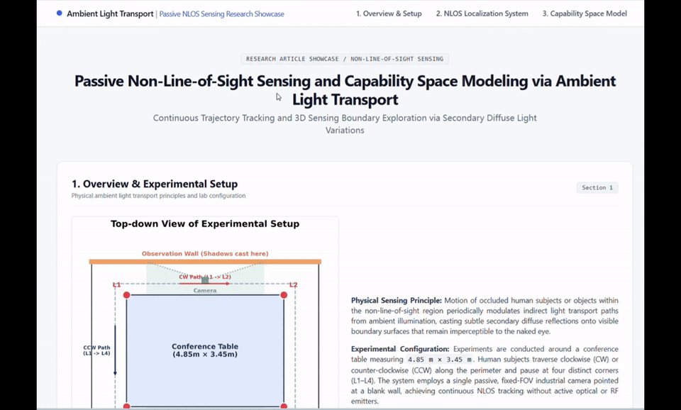
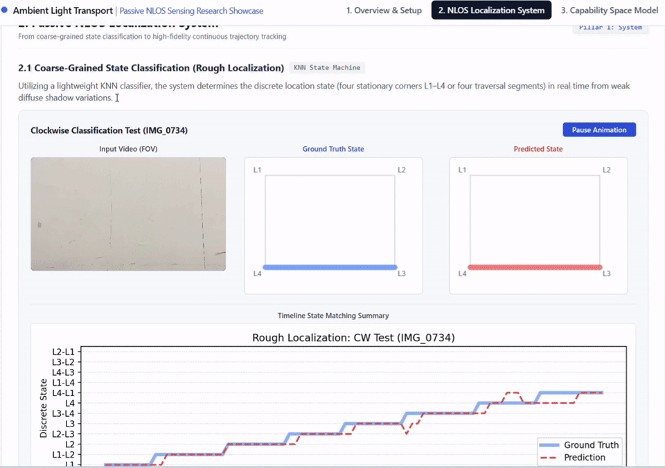
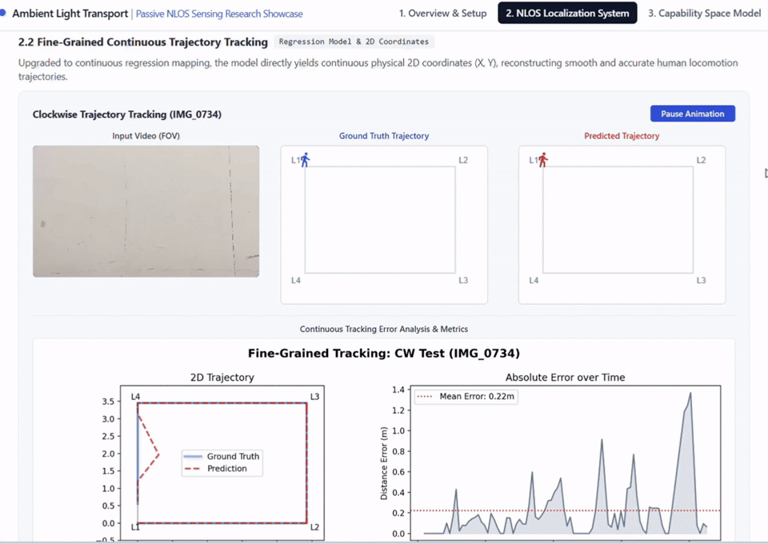
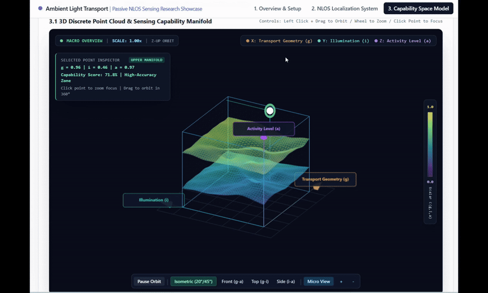

# CaGUS: Ambient-Light Transport Sensing Artifact

This repository accompanies the CaGUS experimental artifact for passive sensing beyond the direct field of view. It contains a reviewable subset of the controlled wall-video experiments, the analysis code used to process them, and the resulting condition-level reports.

**Interactive results:** [https://happencoding.github.io/CaGUS/](https://happencoding.github.io/CaGUS/)
(https://happencoding.github.io/
https://example.com/CaGUS)

The showcase is the quickest way to inspect representative experimental videos, differential response curves, capability-space summaries, and geometry-conditioned activity examples.

## Showcase Preview

The following accelerated recordings preview the interactive showcase directly in the repository.

### 1. Experimental Setup



### 2. Discrete Localization



### 3. Continuous Tracking



### 4. Capability-Space Modeling



If the interactive link is unavailable in an anonymous repository mirror, download the [`showcase/`](showcase/) directory with its assets and open `showcase/index.html` locally in a modern browser.

## What Is Included

| Component | Contents |
| --- | --- |
| `data/` | Representative wall videos, per-condition detection reports, metric tables, trajectory/NTE outputs, and factor summaries. |
| `scripts/` | Differential wall-video detection, factor plotting, capability-boundary analysis, boundary discovery, and geometry-conditioned transport projection. |
| `showcase/` | Static website deployed through GitHub Pages. |
| `repository_manifest.csv` | Inventory of experimental conditions and the representative raw video retained for each condition. |

The repository covers distance, illumination, material, occluder, layout, angle, light-source distribution, and crossed-factor experiments. For each condition, at most one raw video is included to keep the artifact practical to clone and inspect. The full experimental collection is intentionally not distributed here.

## Data Layout

Each condition directory follows a common structure:

```text
data/<factor>/<condition>/
  representative_video.<mp4|mov>
  detection_report.md
  detection_results/
    video_metrics.csv
    condition_summary.json
  trajectory_nte_test.md
  trajectory_nte_test_results/
```

`detection_report.md` contains the temporal differential-response plots for the condition. `video_metrics.csv` stores per-video signal and detection metrics. `condition_summary.json` is the machine-readable condition summary used by the factor and global aggregations. `data/global_detection_summary.md` provides the repository-level overview.

## Requirements

- Python 3.10 or newer
- Git LFS
- Python packages: `numpy`, `opencv-python`, and `matplotlib`

Clone with LFS enabled so that representative videos and showcase media are downloaded rather than LFS pointer files:

```bash
git lfs install
git clone https://github.com/HappenCoding/CaGUS.git
cd CaGUS
python -m pip install numpy opencv-python matplotlib
```

## Reproducing the Differential Detection Pipeline

The primary script measures wall-frame perturbations relative to an automatically selected stable reference segment. It removes brief camera-transition spikes from the reference selection, computes temporal differential statistics, assigns a detection decision, and writes per-condition reports and CSV/JSON outputs.

Run the complete included subset:

```bash
python scripts/run_mobicom_detection.py
```

For a quick smoke test on one representative condition:

```bash
python scripts/run_mobicom_detection.py \
  --only-factor distance \
  --only-condition 850 \
  --limit-videos 1
```

Expected outputs are written under the selected condition's `detection_results/` directory, including `video_metrics.csv`, `condition_summary.json`, and a refreshed `detection_report.md`. The run also refreshes factor-level summaries and `data/global_detection_summary.md`.

Useful controls include `--reference-mode`, `--reference-seconds`, `--active-start-seconds`, `--threshold-z`, and `--min-relative-gain`. Run `python scripts/run_mobicom_detection.py --help` for the complete interface.

## Capability and Geometry Analysis

Aggregate the existing condition summaries into capability tables:

```bash
python scripts/analyze_capability_boundary.py
```

Generate factor-level detection visualizations:

```bash
python scripts/plot_factor_detection_summary.py --root data --factor distance
```

Discover boundary candidates from a representative wall video:

```bash
python scripts/run_transport_boundary_discovery.py data/distance/850/img_8941.mov
```

Run the first-order geometry-conditioned adjoint projection:

```bash
python scripts/run_geometry_projection.py \
  data/distance/850/img_8941.mov \
  scripts/example_transport_geometry.json
```

The projection produces a hidden-space activity response, a peak trajectory, and peak-to-sidelobe-ratio statistics. It is an activity-localization representation conditioned on the supplied geometry, not a reconstructed hidden image. The example configuration is specific to the controlled setup; adapt wall bounds, hidden-region bounds, grid resolution, and occluding segments before using another setup.

## Where to Inspect Results

- **Interactive showcase:** [https://happencoding.github.io/CaGUS/](https://happencoding.github.io/CaGUS/)
- **Global detection summary:** [`data/global_detection_summary.md`](data/global_detection_summary.md)
- **Condition reports:** `data/<factor>/<condition>/detection_report.md`
- **Trajectory/NTE reports:** `data/<factor>/<condition>/trajectory_nte_test.md`
- **Machine-readable metrics:** `data/<factor>/<condition>/detection_results/`

## Artifact Notes

All source paths, device identifiers, timestamps, and location metadata were removed from the distributed reports and representative videos. Videos and static media are stored with Git LFS. GitHub Pages deploys the `showcase/` directory using `.github/workflows/deploy-showcase.yml`.
